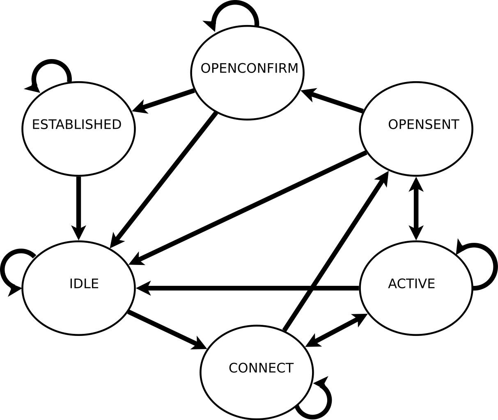

A BGP FSM implementation
========================

KTH
Routing in Internet and other complex networks
Clément Geiger

Introduction
------------

The Border Gateway Protocol (BGP) is defined by `RFC 1771 <http://www.ietf.org/rfc/rfc1771.txt>`__.
Particularly, a BGP connection with a peer is described as Finite State Machine (FSM) in
section 8. The purpose of the homework described by this report was to implement
this FSM using the technology of my choice.

Doing this as a one person team, I had to limit the field of my work. I chose to
implement a straight basic FSM :

 - Establishing a connection with a peer
 - Exchanging KeepAlive messages

Most notably, there no Update mechanism whatsoever. Also, optional parameters
are not taken into account.

However, care was taken about handling errors that could result from the
implemented operations.

FSM Model
---------

This diagram describe succintly the BGP FSM. The major characteristics are the
following:

*Idle*
~~~~~~

This is the start state. Nothing happens here until the Start event is issued.
Once it happens the FSM goes to Connect state.

*Connect* and *Active*
~~~~~~~~~~~~~~~~~~~~~~

In these states, the FSM tries to establish a transport connection with the peer
(configured beforehand). This connection can be established by the FSM (the FSM
*connects* to the peer) or by the peer (the FSM *listens* to incoming connection
from the peer).

In the *Connect* state, an attempt is made to connect to the peer (while
listening to it). If it fails, the FSM goes to *Active* state, where it only
listens to an incoming connection from the peer. After a certain time (defined
by the ConnectRetry timer), the FSM goes back to *Connect* state and tries to
establish a connection with the peer. This goes on until the transport
connection is established.

The state is then *OpenSent*.

*OpenSent*
~~~~~~~~~~

In the *OpenSent* state, the FSM sends an Open message to the peer and waits to
get back the equivalent message from it. It then goes to *OpenConfim* state.

*OpenConfirm*
~~~~~~~~~~~~~

Here, the FSM waits for a KeepAlive message from the peer, upon which it
goes to *Established* state. The FSM itself sends a KeepAlive message when
the KeepAlive timer times out. This means that the earliest of the two
speakers sends a message. The latest goes to Established without sending a
message.

*Established*
~~~~~~~~~~~~~

This is the state where Update messages are exchanged. Upon reception of an
Update or KeepAlive message, the Hold timer is resetted. When the KeepAlive
timer expires, a KeepAlive message is sent. We see here why the KeepAlive
timer value has to be smaller than the Hold timer value.

 - the FSM starts in *Idle* state.
 - In *Connect* and *Active* states, the FSM tries to establish a connection
   with its peer (configured beforehand).
 - Once the connection has been made in either way, an Open message is sent to
   the peer in order to exchange setup information ; this information cover the
   mandatory basics (BGP version, AS number and peer ID) as well as the optional
   parameters that the sender wants to use. Once the message is sent, the state
   is *OpenSent*, and the FSM is waiting for the equivalent Open message from
   its peer.
 - Once the Open message is received, and if it is correct

Timers
~~~~~~

 - *ConnectRetry* : this timer tells the FSM when to retry to connect to
   the peer, if the previous attempts failed
 - *KeepAlive* : this timer tells the FSM to send a KeepAlive message to
   the peer.
 - *HoldTimer* : this timer acts as a watch dog for the state of the
   connection with the peer. If this timer expires, it means that the peer
   has been unable to send an Update or a KeepAlive during this period. It
   is considered as dead and the connection is closed.

Code
----

The FSM is considered as a collection of states, which are connected together
by transitions. This transitions are triggered by events.

The main container (``fsm.js``) holds the various variables and helpers functions (such
as Open and Update message processing functions). On its creation, it
constructs all the states (seen in ``state.js``) and connects them together.

Other files include the networking functions in ``fsm_networking.js``, an
event class in ``fsm_event.js`` and static configuration elements in
``conf.js``.

Conclusion
----------

This project has been a great opportunity to get a deep understanding of how the
BGP protocol works.

It also was the occasion to read completly a RFC, and discover how they are
written, what standards they use and, etc. (e.g. the RFC 2333 defining *how* to
write a RFC, or the RFC 2119 defining the meaning of the different verbs used).

At last, the javascript (and more specifically Node.Js) philosophy being quite
different from what I've been used to so far, it was also a nice inview in these
technologies.
